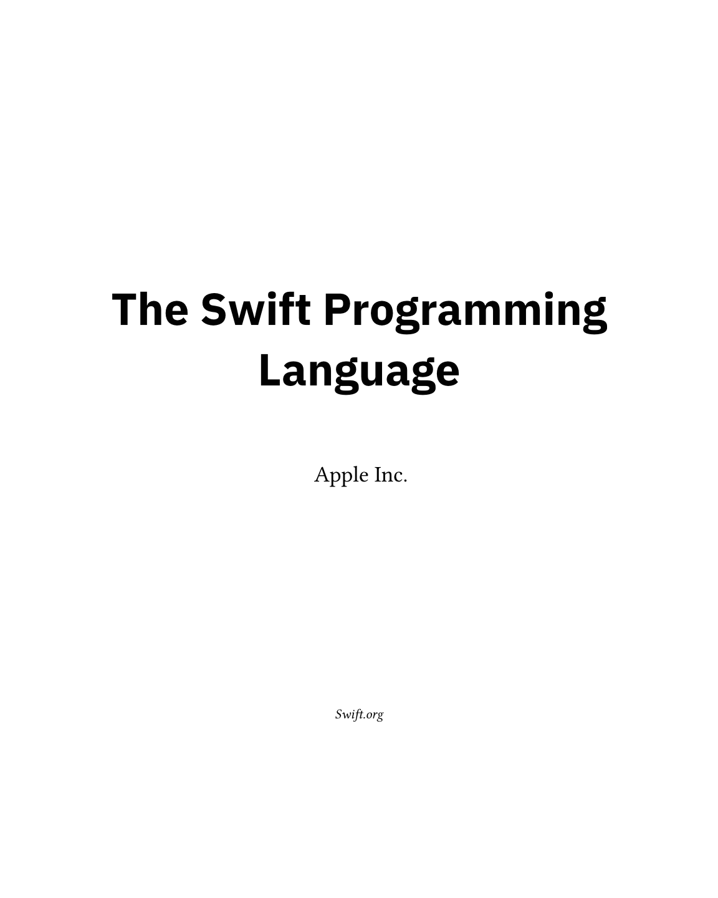
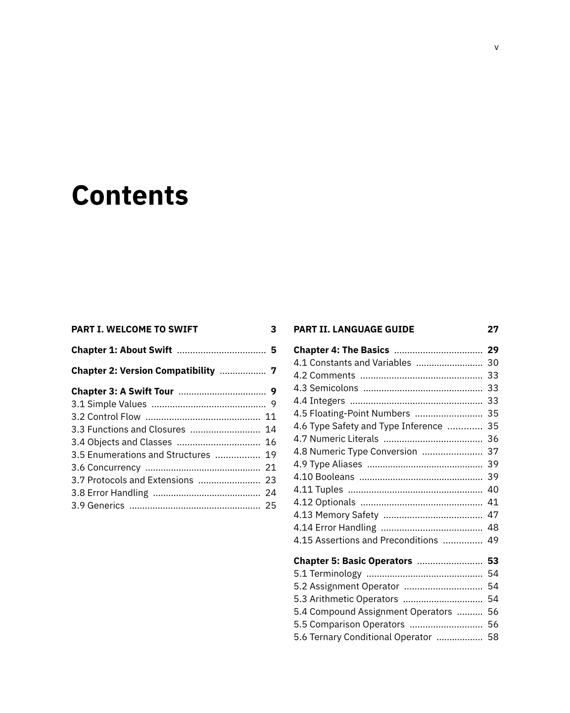
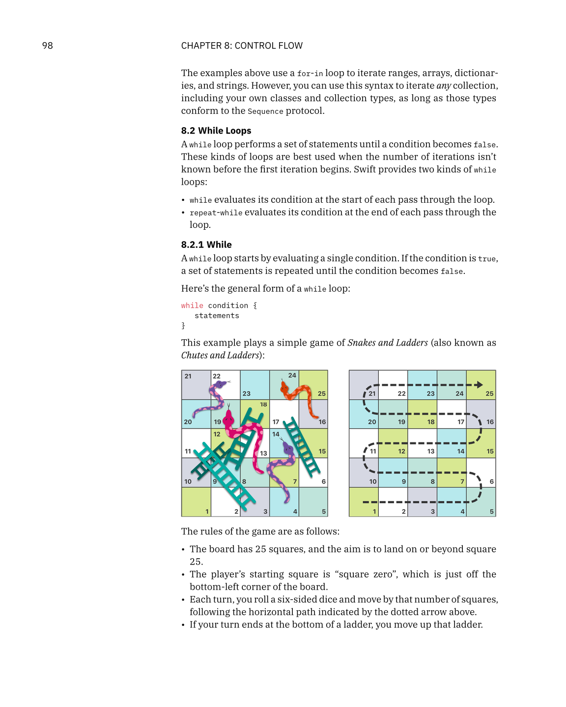
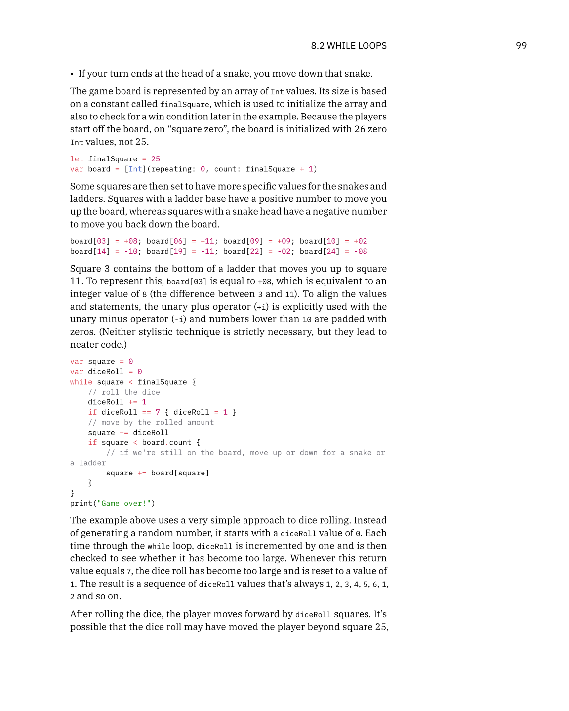
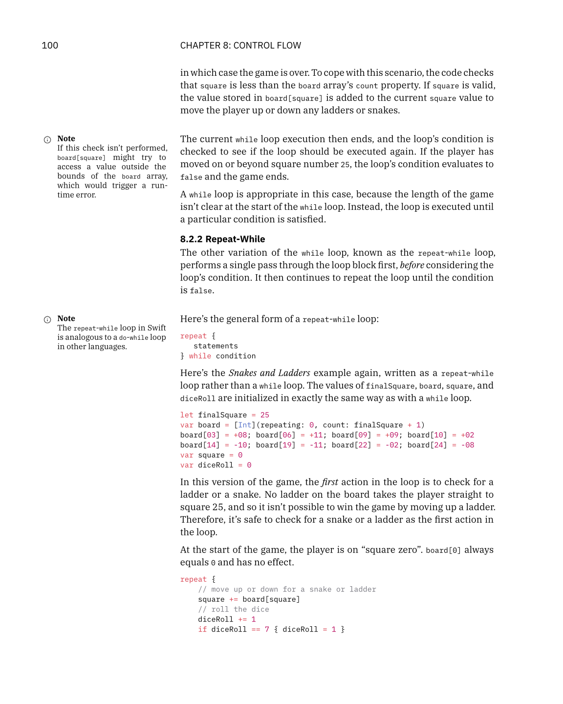

# The Swift Programming Language

[](https://github.com/peterfriese/swift-book/releases/latest/download/swift-book.pdf)

<p align="center">
  
  
  
  
  
</p>

This repository contains the source for *The Swift Programming Language*
(sometimes abbreviated as TSPL),
which is published on [docs.swift.org][published]
and built using [Swift-DocC][docc].

This fork creates a **beautiful, printable PDF edition** using [Typst](https://typst.app/).

## Contributing

For small changes,
like typo fixes and changes to a few paragraphs,
fork this repository and make a pull request.

A formal contribution process for this document is still in development.
In the meantime,
start a pitch thread in the [Swift forums][forum] for larger changes
to discuss your approach and identify possible issues
before you invest a lot of time in writing.

Content in this book follows [Apple Style Guide][asg]
and [this book’s style guide][tspl-style].

File bugs about the content using the [issues page][bugs] on Github.

Discussions and contributions follow the [Swift Code of Conduct][conduct].

For more information, see [Contributing to The Swift Programming Language][contributing].

[asg]: https://help.apple.com/applestyleguide/
[bugs]: https://github.com/swiftlang/swift-book/issues
[conduct]: https://www.swift.org/code-of-conduct
[contributing]: /CONTRIBUTING.md
[forum]: https://forums.swift.org/c/swift-documentation/92
[tspl-style]: /Style.md
[published]: https://docs.swift.org/swift-book/documentation/the-swift-programming-language/
[docc]: https://github.com/swiftlang/swift-docc

## Building

Run `docc preview TSPL.docc`
in this repository's root directory.

After running DocC, open the link that `docc` outputs
to display a local preview in your browser.

> Note:
>
> If you installed DocC by downloading a toolchain from Swift.org,
> `docc` is located in `usr/bin/`,
> relative to the installation path of the toolchain.
> Make sure your shell's `PATH` environment variable
> includes that directory.
>
> If you installed DocC by downloading Xcode,
> run `xcrun docc preview TSPL.docc` instead.


## Building the PDF

**The PDF is built automatically** on every push to the `pdf-edition` branch and attached to Releases. You generally do not need to build it manually.

However, if you want to build a local copy:

### Prerequisites

| Tool | Version | Notes |
| :--- | :--- | :--- |
| **Python** | 3.10+ | Required for migration scripts. |
| **Typst** | 0.13.0+ | [Install Typst](https://github.com/typst/typst) |
| **Gemini API Key** | Optional | Set `GEMINI_API_KEY` for AI-generated chapter eyebrows. |

### Build Command

We provide a unified build script that handles everything for you:

```bash
bin/build-pdf
```

This command will:
1.  Check for required tools and download fonts if missing.
2.  Convert the source content from DocC to Typst format (stored in `generated/`).
3.  Compile the final PDF to `swift-book.pdf` in the root directory.
