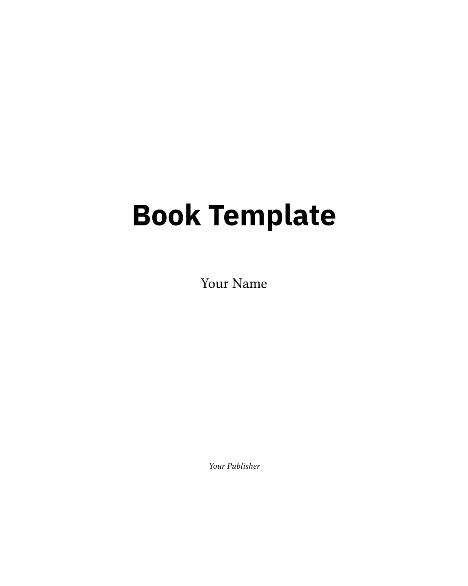

# EightByTen

**EightByTen** is a Typst package for creating beautiful Tufte-style books with extensive support for marginalia, custom layouts, and automated figures. Ideally suited for technical books, textbooks, and long-form documents.



## Features

- **Tufte-Style Layout**: Authentic wide margins for sidenotes, margin figures, and captions.
- **Automated Book Structure**: Built-in support for Parts, Chapters, Appendices, and Backmatter.
- **Smart Headers & TOC**: Automated running headers and Table of Contents generation.
- **Code Highlighting**: Integrated support for `codly` with custom styling for clean code blocks.
- **Custom Blocks**: Semantic blocks for `Design Notes`, `Challenges`, and more.
- **Configurable Design**: Easily customize page size, fonts, and sizes.
- **Index Generation**: Integrated index support via `in-dexter`.

## Getting Started

### Local Installation (Recommended)

Since this package is not yet published to the Typst Universe, you must install it locally:

1.  **Clone the repository**:
    ```sh
    git clone https://github.com/peterfriese/eightbyten.git
    cd eightbyten
    ```

2.  **Install the package**:
    This uses `just` to package the library and install it to your local Typst data directory (under `@local/eightbyten`).
    ```sh
    just install
    ```

3.  **Use it in your project**:
    Import the package using the `@local` namespace:
    ```typ
    #import "@local/eightbyten:0.1.0": *

    #show: eightbyten.with(
      title: "My Awesome Book",
      authors: ("Jane Doe",),
      publisher: "Tech Press",
      book: true,
    )

    #chapter("Introduction")
    Welcome to my book!
    ```

### Using the Template

Once installed locally, you can initialize a new project using the template:

```sh
typst init @local/eightbyten my-new-book
cd my-new-book
typst watch
```

Alternatively, you can manually copy the `template` directory to your project.


## Usage

### Document Structure

Wrap your content in `frontmatter`, `main content`, and `backmatter`:

```typ
#frontmatter[
  #dedication[To my cat.]
  #toc()
  #pagebreak()
  #list-of-design-notes
]

#mainmatter[
  #part("The Beginning")
  #include "chapters/01-introduction.typ"

  #part("The End")
  #include "chapters/02-conclusion.typ"
]

#backmatter[
  #appendix-part("Appendices")
  #include "chapters/99-appendix.typ"

  #special-appendix("Index")
  #make-index(title: none, outlined: false)
]
```

### Chapters & Parts

Inside the main matter, use `#part("...")` to divide your book into major sections. Individual chapters are typically included from separate files:

```typ
#part("Foundations")
#include "chapters/01-basics.typ"
```

And inside your chapter file (e.g., `chapters/01-basics.typ`), start with `#chapter()`:

```typ
// In chapters/01-basics.typ
#chapter("The Basics")

Here is the content of the chapter...
```

### Marginalia

Add notes to the margin using `note()` or implicit placement (Tufte-style):

```typ
Here is some text with a sidenote.#note[This text appears in the margin.]
```

### Figures

Use `notefigure` to place simple figures in the margin:

```typ
#notefigure(
  image("figure.png"),
  caption: [A margin figure]
)
```

Use `wideblock` for wide content that spans the main column and margin:

```typ
#wideblock[
  #table(columns: 4)[...]
]
```

### Code Blocks

Code blocks are automatically styled using `codly`.

````typ
```rust
fn main() {
    println!("Hello, world!");
}
```
````

To disable `codly` support, set `codly-support: false` in the configuration.

## Configuration

The `eightbyten` function accepts several configuration parameters:

| Parameter       | Type      | Default             | Description |
| :---            | :---      | :---                | :--- |
| `title`         | `string`  | `"Eight by Ten"`    | Title of the book. |
| `authors`       | `array`   | `()`                | List of authors. |
| `publisher`     | `string`  | `"..."`             | Publisher name. |
| `isbn`          | `string`  | `"..."`             | ISBN text. |
| `paper`         | `string`  | `"8in x 10in"`      | Page size (e.g., "a4", "us-letter" or none for default). |
| `fonts`         | `dict`    | `default-fonts`     | Setup for `serif`, `sans`, and `mono`. |
| `debug`         | `bool`    | `false`             | Show debug frames for layout. |
| `codly-support` | `bool`    | `true`              | Enable `codly` integration. |

### Font Customization

You can provide your own font family names:

```typ
#show: eightbyten.with(
  fonts: (
    serif: "Linux Libertine",
    sans: "Inter",
    mono: "Fira Code"
  ),
  // ...
)
```

## Contributing

Contributions are welcome! Please open an issue or submit a pull request on [GitHub](https://github.com/peterfriese/eightbyten).

### Local Development

To develop `eightbyten` locally:

1. Clone the repository.
2. Install the package locally:
   ```sh
   just install
   ```
3. Run the verification:
   ```sh
   just verify-template
   ```

## License

MIT
